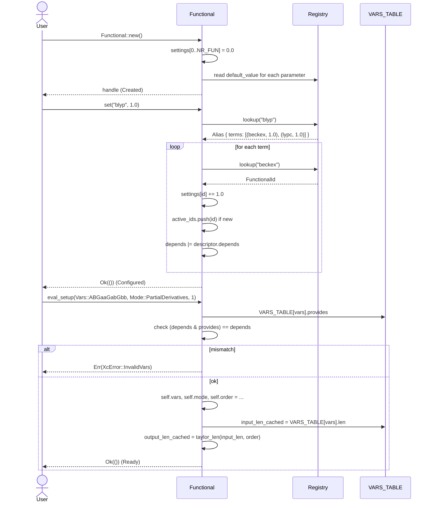
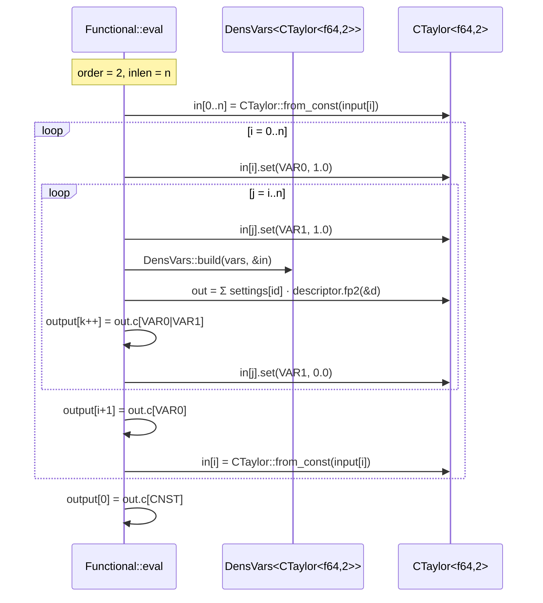
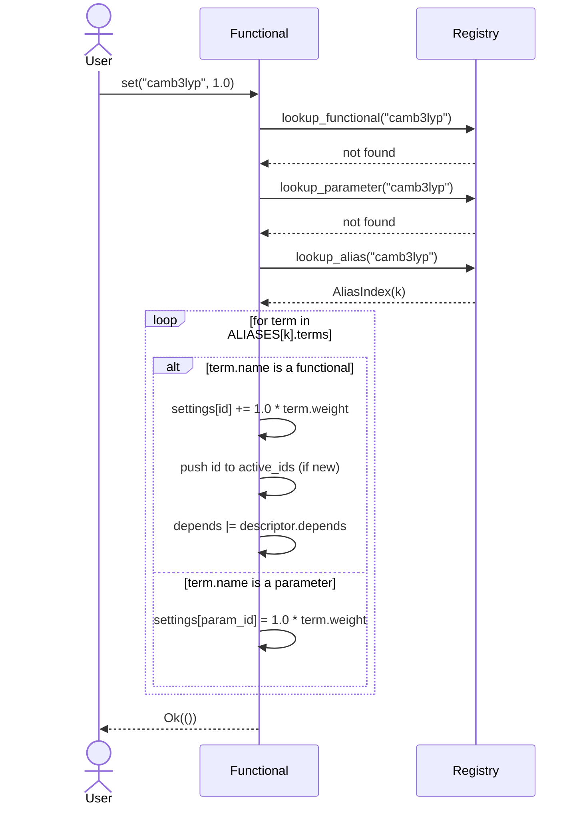
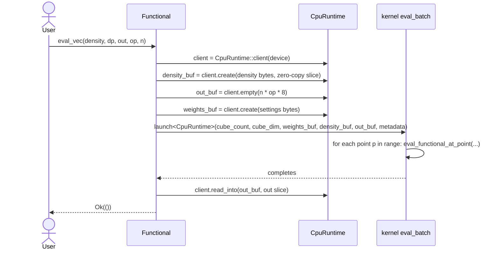
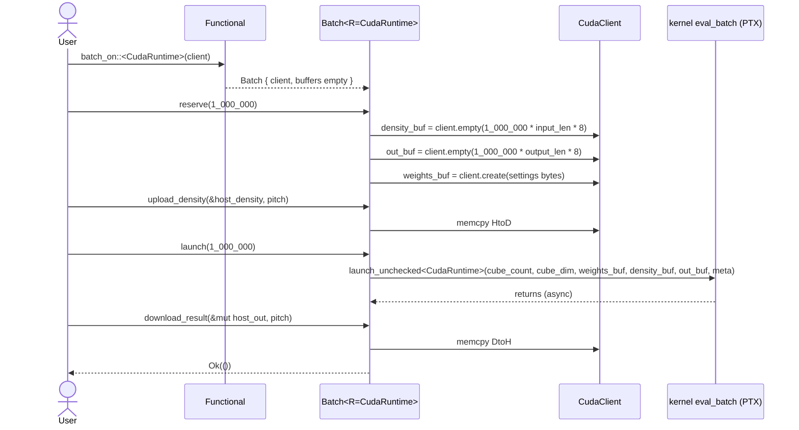
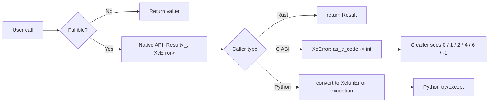

# 04 — Control flow

Mermaid diagrams for every user-visible path through `xcfun_rs`. Each corresponds directly to one of the C++ reference call paths in `XCFunctional.cpp` / `xcint.cpp`; where the Rust version differs, the difference is called out.

All diagrams use the native Rust API (`crates/xcfun-rs`). The C ABI is a thin forwarding layer and shares the same flow.

---

## 1. Lifecycle overview

```mermaid
stateDiagram-v2
    [*] --> Created: Functional::new()
    Created --> Configured: set("blyp", 1.0)
    Configured --> Configured: set(parameter, value)
    Configured --> Ready: eval_setup(vars, mode, order)
    Ready --> Ready: eval(...) / eval_vec(...)
    Ready --> Ready: batch_on(runtime)
    Ready --> [*]: drop
    Configured --> Configured: reconfigure via set()
    Ready --> Configured: eval_setup() with new vars/mode/order
```

State invariants:

| State | `depends` | `active_ids` | `vars` | `mode` | `order` |
|-------|-----------|--------------|--------|--------|---------|
| Created | empty | `[]` | `Unset` | `Unset` | `-1` |
| Configured | non-empty | non-empty | any | any | any |
| Ready | non-empty | non-empty | concrete | concrete | 0..6 |

---

## 2. Setup: from user intent to a ready `Functional`



Implementation correspondence:
- `set` follows `xcfun_set` in `xcfun-master/src/XCFunctional.cpp` lines 369-405 exactly, including the recursive alias expansion with weight multiplication.
- `eval_setup` validation matches lines 426-452.
- `output_length` dispatch matches lines 473-491.

---

## 3. Single-point evaluation (`Functional::eval`)

This is the hot path. It is shared between the scalar CPU fallback and the `cubecl::CpuRuntime` dispatch.

```mermaid
flowchart TD
    Start([Functional::eval]) --> Check{Ready?}
    Check -- No --> NotConf[Return NotConfigured]
    Check -- Yes --> LenCheck{Lengths valid?}
    LenCheck -- No --> LenErr[Return *LengthMismatch]
    LenCheck -- Yes --> Dispatch{mode}

    Dispatch -- PartialDerivatives --> OrderMatch{order}
    OrderMatch -- 0 --> CT0[Seed [CTaylor f64 0] inputs]
    OrderMatch -- 1 --> CT1[Seed pairs CTaylor f64 2 + solo CTaylor f64 1]
    OrderMatch -- 2 --> CT2[Nested loops (i,j): CTaylor f64 2]
    OrderMatch -- 3 --> CT3[Triple nested: CTaylor f64 3 + fall-through to 2]
    OrderMatch -- 4 --> CT4[Quadruple nested: CTaylor f64 4 + fall-through]

    CT0 --> Build0[DensVars::build]
    CT1 --> Build1[DensVars::build]
    CT2 --> Build2[DensVars::build]
    CT3 --> Build3[DensVars::build]
    CT4 --> Build4[DensVars::build]

    Build0 --> SumActive0[for each active id: out += settings[id] * fp0(d)]
    Build1 --> SumActive1[out += settings[id] * fp2(d)]
    Build2 --> SumActive2[out += settings[id] * fp2(d)]
    Build3 --> SumActive3[out += settings[id] * fp3(d)]
    Build4 --> SumActive4[out += settings[id] * fp4(d)]

    SumActive0 --> WriteEnergy[output[0] = out.c[CNST]]
    SumActive1 --> WritePartial1[output[0] = CNST; output[j+1] = out.c[VAR0|VAR1 slot]]
    SumActive2 --> WritePartial2[output[0..n+1] = CNST+grad; upper triangular Hessian]
    SumActive3 --> WritePartial3[second-order block + third-order block (i≤j≤s)]
    SumActive4 --> WritePartial4[third-order block + fourth-order block]

    Dispatch -- Potential --> PotPath[see diagram §5]
    Dispatch -- Contracted --> ConPath[see diagram §6]

    WriteEnergy --> End([Ok])
    WritePartial1 --> End
    WritePartial2 --> End
    WritePartial3 --> End
    WritePartial4 --> End
    PotPath --> End
    ConPath --> End
```

The `OrderMatch` block mirrors the exact `switch (fun->order)` at `xcfun-master/src/XCFunctional.cpp` lines 501-616 (including the fallthrough from case 3 to case 2, lines 587-612, and the analogous case 4 → 3 → 2 chain).

### 3.1 Order-2 nested-loop detail



This matches lines 589-612 of `XCFunctional.cpp`.

---

## 4. Parameter binding (alias expansion) in depth



No nested aliases exist in the current `aliases.cpp`; the recursion depth is bounded by 1 in practice, but the implementation allows arbitrary depth with a runtime check to prevent cycles.

---

## 5. `XC_POTENTIAL` flow

Potential mode produces `[E, V_α]` (restricted) or `[E, V_α, V_β]` (spin-resolved). The flow mirrors `XCFunctional.cpp` lines 637-791 and is intricate: it combines one LDA-like evaluation at order 1 plus, for GGA, three directional evaluations at order 2 to assemble the divergence term.

```mermaid
flowchart TD
    Entry([eval, mode=Potential]) --> Basis[Seed CTaylor<f64,1> density inputs]
    Basis --> NPot{inlen in {1, 10}?}
    NPot -- yes --> NP1[npot = 1]
    NPot -- no --> NP2[npot = 2, inpos = 1 or 10]
    NP1 --> Loop0
    NP2 --> Loop0

    Loop0[for j in 0..npot] --> Seed[in[j*inpos].set(VAR0, 1.0)]
    Seed --> Build1[DensVars::build]
    Build1 --> Sum1[out = Σ settings[id] · fp1(d)]
    Sum1 --> Emit[output[0] = CNST; output[j+1] = VAR0 coefficient]
    Emit --> Reset[restore in[j*inpos]]
    Reset --> NextJ{more j?}
    NextJ -- yes --> Seed
    NextJ -- no --> GGA{depends & GRADIENT?}

    GGA -- no --> End([Ok])
    GGA -- yes --> GGAPath[assemble three directional CTaylor<f64,2> evaluations]
    GGAPath --> Assemble[output[j+1] -= (d/dx + d/dy + d/dz) of dE/dgradient]
    Assemble --> End
```

The GGA potential path reuses the AD engine by constructing `CTaylor<f64,2>` inputs whose `VAR0` slot encodes spatial dependence on the density and whose `VAR1` slot encodes dependence on the gradient component, then reads the mixed `VAR0|VAR1` coefficient as the divergence term. Fidelity to the reference is anchored by a golden test over restricted and unrestricted GGA potentials.

---

## 6. `XC_CONTRACTED` flow

```mermaid
sequenceDiagram
    participant Fun as Functional::eval
    participant AD as CTaylor<f64, ORDER>
    Note over Fun: ORDER = self.order; inlen = VARS_TABLE[vars].len
    loop i = 0..inlen
        loop j = 0..(1 << ORDER)
            Fun->>AD: in[i].set(j, input[k++])
        end
    end
    Fun->>Fun: d = DensVars::build(vars, &in)
    Fun->>AD: out = Σ settings[id] · fp{ORDER}(d)
    loop i = 0..(1 << ORDER)
        Fun->>Fun: output[i] = out.c[i]
    end
```

Matches `DOEVAL(N, E)` macro expansion at `XCFunctional.cpp` lines 619-635. Each bit position of the input stream becomes a tensored direction; the output is the full set of bit-indexed derivatives.

---

## 7. Batch evaluation (`eval_vec` and `Batch<'fun, R>`)

### 7.1 CPU fallback via `cubecl::CpuRuntime`



With `CpuRuntime`, the kernel is lowered to native Rust; the `create`/`read` calls are memcpy (or zero-copy when the buffer alignment permits), and the launch is a parallel for-loop over points.

### 7.2 GPU path



Host↔device transfers are minimised by persisting `weights_buf` across launches and reusing `density_buf` / `out_buf` when capacity allows. See [06-cubecl-strategy.md](06-cubecl-strategy.md) for transfer rules.

---

## 8. Error-propagation paths



Every error originates from one of: `UnknownName` (lookup failure), `InvalidOrder`, `InvalidVars`, `InvalidMode`, `InputLengthMismatch`, `OutputLengthMismatch`, `NotConfigured`, `InvalidEncoding`. No `panic!` in the library crates on recoverable inputs; panics reserved for detected invariant violations that cannot occur through the public API (bounded by debug assertions). See [08-error-model.md](08-error-model.md) for details.

---

## 9. GPU kernel internal flow (one thread)

```mermaid
flowchart TD
    T0([CUBE thread i]) --> Pos[p = ABSOLUTE_POS]
    Pos --> Guard{p < n_points}
    Guard -- no --> Done([return])
    Guard -- yes --> Load[local_density = density[p*pitch + 0..input_len]]
    Load --> Seed[build CTaylor inputs with VAR* slots per order]
    Seed --> Build[DensVars::build local_density]
    Build --> SumLoop[for k in 0..nr_active_functionals]
    SumLoop --> Descr[descriptor_id = active_ids[k]]
    Descr --> Branch[match descriptor_id: call fp{ORDER}_kernel(d)]
    Branch --> Accum[out += weight[descriptor_id] * contribution]
    Accum --> MoreK{more k?}
    MoreK -- yes --> SumLoop
    MoreK -- no --> Write[result[p*pitch_out + 0..output_len] = layout(out)]
    Write --> Done
```

The `match descriptor_id` is dispatched via a compile-time-generated big switch (see `xcfun-kernels::dispatch_table`), which translates to a jump-table on GPU. `weight[id]` is read from `weights_buf` (uploaded once per batch). `fp{ORDER}_kernel` is the `#[cube]` counterpart of the CPU functional, written once against the generic `Num` trait.

---

## 10. Summary

Each flow maps one-to-one with a block of C++ reference code; the correspondence is preserved so that the numerical-parity harness can compare outputs at the same conceptual point in the evaluation. The dispatcher never allocates, never panics on user data, and never strays from the fixed decision tree: `(state?, mode?, order?)`.
